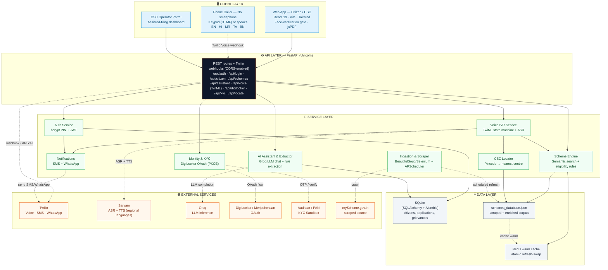
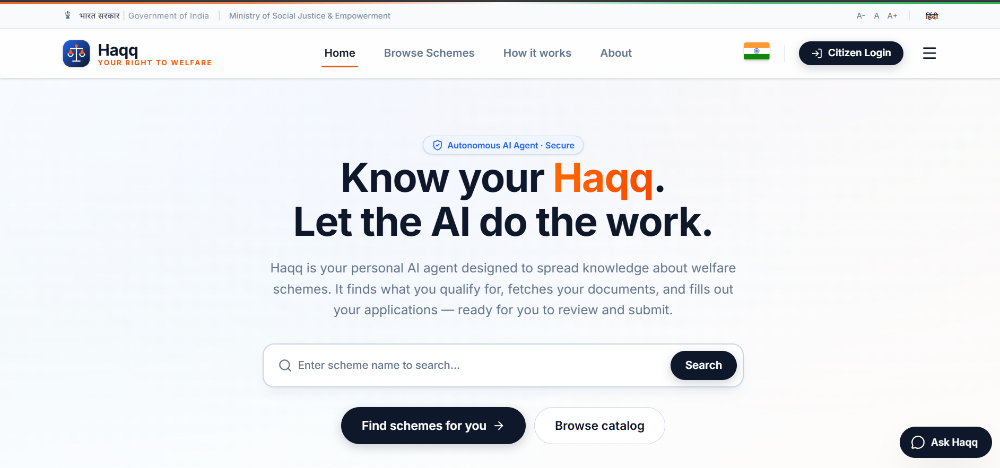
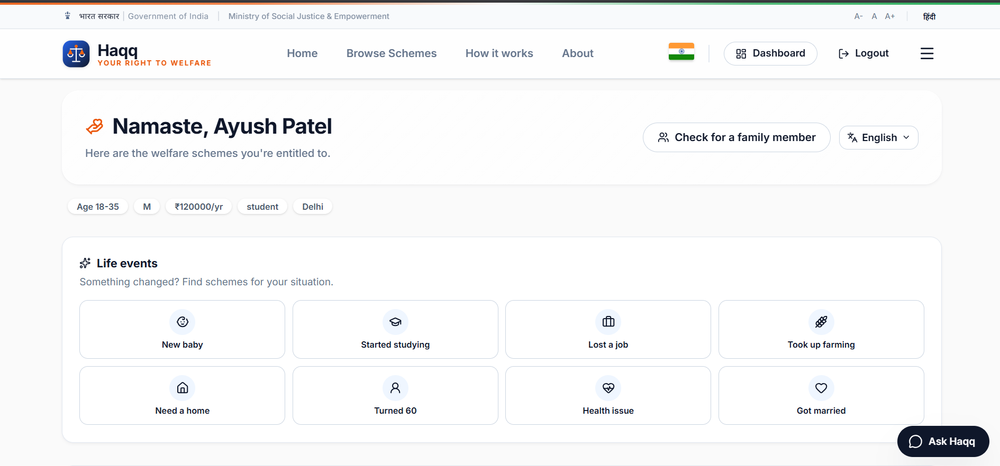
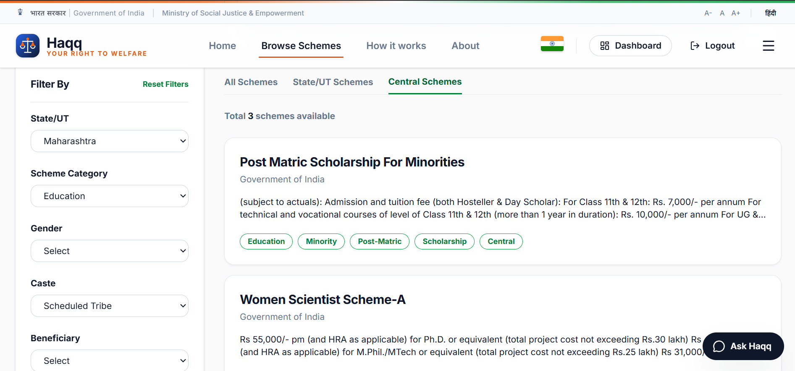
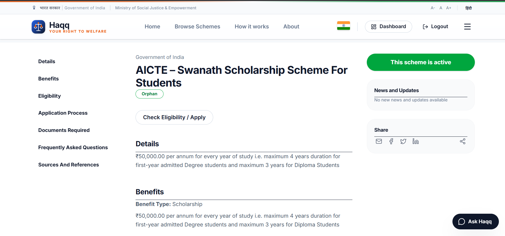
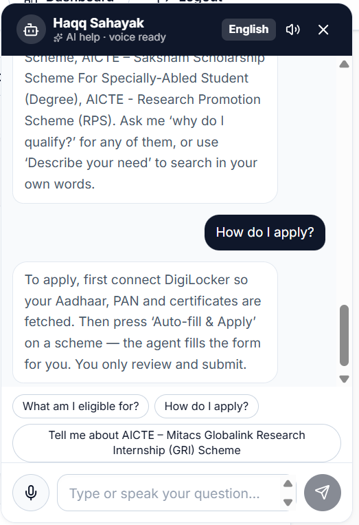
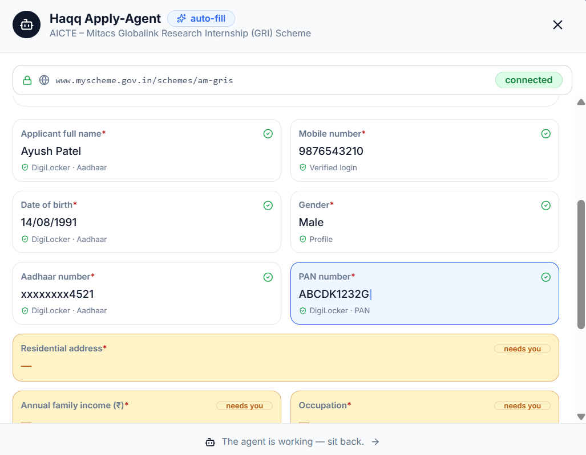
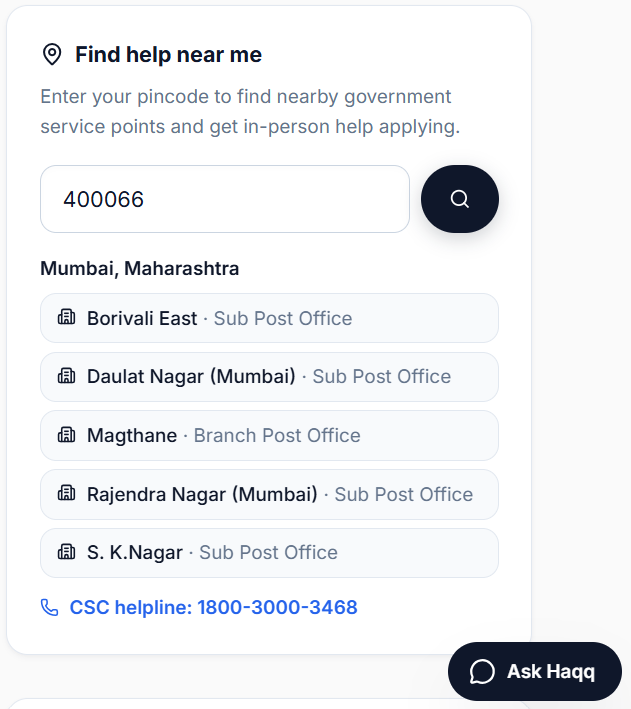

<div align="center">

# 🪪 Haqq
### *Your Right, Simplified.*

**An AI-powered civic-tech platform that connects Indian citizens to the government welfare schemes they're entitled to — over the web, and over a phone call.**

[](https://merahaqq.duckdns.org/)


</div>

---

## 🧭 Why Haqq

India runs thousands of welfare schemes — scholarships, pensions, subsidies, insurance — but the biggest barrier isn't eligibility, it's **discovery**. Citizens don't know what exists, don't know if they qualify, and the ones who need help most (rural users, low-literacy users, people without smartphones) are the ones least served by another web portal.

**Haqq** solves this two ways at once:

1. A modern web app that matches a citizen's profile against live scheme data using semantic search and an AI eligibility engine.
2. A **plain telephone hotline** — no app, no internet, no literacy required — where a citizen dials in, picks a language, and either presses digits or *just speaks their problem out loud* to get matched to schemes and the nearest help center.

---

## 📐 Architecture



> Solid arrows = synchronous request/response · Dashed arrows = async jobs or third-party API calls. Note how the **Voice IVR** and **web routes** both flow through the same Scheme Engine and CSC Locator — the phone and web channels never drift out of sync because they share the same core services.

**Stack at a glance:**

| Layer | Technology |
|---|---|
| Frontend | React 19, Vite, Tailwind CSS 4, react-router-dom |
| Backend | FastAPI (Python), Uvicorn |
| Data | SQLite (SQLAlchemy + Alembic), Redis cache |
| Auth | JWT (PyJWT), bcrypt-hashed PINs |
| Voice | Twilio Voice (TwiML), Sarvam ASR/TTS |
| Messaging | Twilio SMS + WhatsApp Business API |
| Identity | DigiLocker / Meripehchaan OAuth (PKCE), Aadhaar/PAN KYC sandbox |
| AI | Groq-hosted LLM (assistant + rule extraction), scikit-learn / sentence-transformers (semantic search) |
| Scraping/Ingestion | BeautifulSoup, Selenium, APScheduler |

---

## ✨ Core Features

### 🏠 Citizen Web Portal



A government-portal-styled landing experience — built to feel official and trustworthy from the first screen, with multi-language support baked in from the start.

<br>



Once registered (mobile number + PIN, bcrypt-hashed, JWT session), citizens land on a personalized dashboard showing their matched schemes, applications, and profile.

<br>

### 🔍 Scheme Discovery & Filtering



- Live scheme data scraped from **myScheme.gov.in** via a scheduled ingestion pipeline (crawl → diff → enrich → atomic cache swap)
- Filter by age, gender, income slab, occupation, and state
- Semantic search (TF-IDF fallback + sentence-transformer embeddings) lets users describe their need in plain language instead of navigating rigid categories

<br>



- An LLM-driven rule extractor converts unstructured scheme text into structured eligibility rules
- An "Explain this scheme" AI action breaks down benefits and eligibility in plain language
- A **relative check** flow lets a user check eligibility on behalf of a family member

<br>

### 🤖 AI Assistant



A Groq-backed conversational assistant grounded in the citizen's own profile and matched schemes — answers questions, explains jargon, and suggests next steps, with audio transcription support for voice input on the web too.

<br>

### 🧾 Auto-Apply Agent



- Auto-fills scheme application fields from the citizen's verified profile/KYC data
- Generates a polished, branded **PDF application summary** (jsPDF) with a document checklist and verification status
- Tracks applications with generated ticket IDs and supports filing a **grievance** against a stuck application

<br>

### 📍 Nearest Help Center Locator



Pincode-based lookup for the nearest **Common Service Centre (CSC)** — the same lookup logic is reused by the voice hotline below, so it works identically whether a citizen is on the website or on a phone call.

<br>

### 📞 Twilio Voice Hotline (IVR) — *No smartphone required*

The feature built specifically for citizens the web app can't reach:

- **Multi-language menu** — English, Hindi, Marathi, Tamil, Bengali — selectable by keypress
- **DTMF-driven eligibility flow** — age, gender, income, and occupation collected via keypad, matched against the live scheme database, and read back with Sarvam text-to-speech (falling back to Twilio's built-in TTS if unavailable)
- **Nearest CSC by pincode** — spoken directly over the call
- **Free-form spoken queries** — the caller simply *describes their problem* after a beep; the recording is transcribed via **Sarvam ASR**, matched with the same semantic search engine used on the web, filtered through the eligibility engine, and the top matches are read back — in the language the caller spoke
- **Registered caller recognition** — a repeat caller is recognized by phone number and skips straight to personalized results

### 💬 Twilio SMS & WhatsApp Notifications

- Automated **SMS confirmations** when an application is submitted
- **WhatsApp Business API** integration for template + free-form session messages, including media attachments

### 🪪 Digital Identity & KYC

- **DigiLocker / Meripehchaan OAuth** integration (PKCE-secured) with a pluggable provider architecture — swap between mock, sandbox, and real Meripehchaan providers without touching route code, to pull verified citizen documents
- **Aadhaar OTP generation & verification**, **PAN verification**, and combined Aadhaar–PAN status checks against a sandbox KYC provider
- **Face verification gate** on the frontend (`@vladmandic/face-api`) as a liveness/identity check before sensitive flows

### 🏢 CSC Operator Access

A separate login path for Common Service Centre operators, laying the groundwork for an assisted-filing dashboard where CSC staff can help citizens who walk in.

---

## 🗺️ End-to-End User Flow

```
                     ┌───────────────────────┐
                     │   Citizen has a need   │
                     └───────────┬───────────┘
                                 │
                 ┌───────────────┴────────────────┐
                 │                                 │
          Has smartphone/internet          No smartphone/internet
                 │                                 │
                 ▼                                 ▼
        ┌─────────────────┐              ┌──────────────────────┐
        │   Web Portal     │              │   Dial the hotline    │
        │  (React + Vite)  │              │   (Twilio Voice IVR)  │
        └────────┬─────────┘              └───────────┬──────────┘
                 │                                     │
     Register / Login (JWT + bcrypt PIN)      Select language (keypress)
                 │                                     │
     Filter or semantically search schemes    Answer via keypad OR just speak
                 │                                     │
     AI explains + eligibility engine          Sarvam ASR → semantic search
        evaluates structured rules                → eligibility engine
                 │                                     │
     Auto-fill application + generate PDF      Results read back via
                 │                              Sarvam/Twilio TTS
     Submit application → ticket ID                    │
                 │                            Nearest CSC read out loud
     SMS/WhatsApp confirmation (Twilio)                 │
                 │                                     ▼
     Raise grievance if stuck            Citizen visits nearest CSC in person
                 │                        or continues on the web later
                 ▼
        Track status on dashboard
```

---

## 🔧 Notable Engineering Details

- **Atomic cache refresh** — scheme data is re-scraped and re-enriched on a schedule (APScheduler), then swapped into the Redis-backed cache atomically so searches never see a half-updated dataset
- **Pluggable identity providers** — DigiLocker integration is written against an abstract provider interface, so mock/sandbox/production backends are interchangeable via config, not code changes
- **Shared logic across channels** — the CSC locator and scheme-matching services are called identically from the REST API and the Twilio voice webhooks, so the web and phone experiences never drift apart
- **Language-aware everywhere** — the same 5-language set spans the web UI, the AI assistant, and the IVR menus/TTS

---

## 🚀 Local Setup

```bash
# Backend
cd backend
pip install -r requirements.txt
uvicorn main:app --reload

# Frontend
cd frontend
npm install
npm run dev   # http://localhost:5173
```

Environment variables (backend `.env`) include SQLite/Redis config, `JWT_SECRET`, Twilio credentials (`TWILIO_ACCOUNT_SID`, `TWILIO_AUTH_TOKEN`, `TWILIO_PHONE_NUMBER`, `TWILIO_WHATSAPP_NUMBER`), Sarvam API keys, and a Groq API key for the AI assistant.

---

<div align="center">

**🌐 Live at [merahaqq.duckdns.org](https://merahaqq.duckdns.org/)**

</div>
